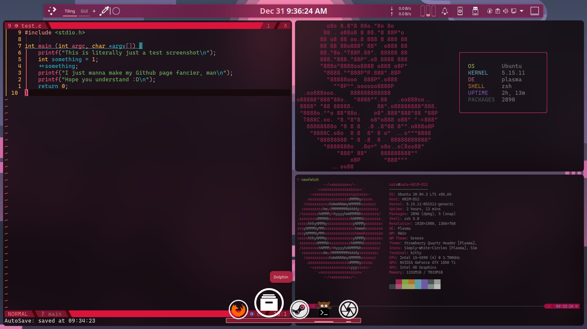

# Nate-Dotfiles

Syncing my personal configs.

This init.vim is intended to be used with Neovim and VSCode.

As of 12/14/2021, this config is no longer intended to be used with
VSCode because it is now written in lua.

As of 12/31/2021, this repo also includes the configs for my Linux setup.
This includes KDE Plasma 5, Kitty Terminal, and zsh.

## When Transferring Setup
This repository now uses [dotdrop](https://github.com/deadc0de6/dotdrop) to manage files.

Run the following command once cloned.
```
# For coding, includes nvim, zsh, kitty
./dotdrop.sh compare -p coding # We compare to double-check
./dotdrop.sh install -p coding

# For KDE
./dotdrop.sh compare -p kde
./dotdrop.sh install -p kde
```
- Edit the fm6000 command in .zshrc to point to wherever the rose.txt file is.
- Or delete that and the taskwarrior commands if not needed

## Prerequisites

- [Kitty Terminal](https://sw.kovidgoyal.net/kitty/binary/)
  - NOTE: Linux only
- [zsh](https://gist.github.com/derhuerst/12a1558a4b408b3b2b6e)
  - [Taskwarrior](https://github.com/GothenburgBitFactory/taskwarrior)
  - [Fetch-master 6000](https://github.com/anhsirk0/fetch-master-6000) for ricing
- [Neovim >= 0.6](https://github.com/neovim/neovim)
  - Node.js
    - Choco if on Windows, I guess?
  - Python 3.10 (and pip)
  - [fzf](https://github.com/junegunn/fzf)
    - [bat](https://github.com/sharkdp/bat)
    - [Ag](https://github.com/ggreer/the_silver_searcher) as well
    - And [ripgrep](https://github.com/BurntSushi/ripgrep)
  - A Nerd Font
    - I prefer [CaskaydiaCove Nerd Font Mono](https://github.com/ryanoasis/nerd-fonts/releases/download/v2.1.0/CascadiaCode.zip)
- KDE Plasma
  - [Krohnkite](https://github.com/esjeon/krohnkite)
    - Maybe upgrade to Bismuth on a later version of KDE Plasma
  - [Latte Dock](https://github.com/KDE/latte-dock)
    - NOTE: May require the latest version of [Qt5](https://www.qt.io/download-open-source?hsCtaTracking=9f6a2170-a938-42df-a8e2-a9f0b1d6cdce%7C6cb0de4f-9bb5-4778-ab02-bfb62735f3e5)
      - Scroll down to the bottom, click "Download the Qt Online Installer"
  - A forced blur script from KWin Scripts to make Kitty gorgeous
- Git
- Language Tools
  - gcc, g++, gdb
  - Well, there's already python, but yeah you need it
  - pyright
  - Lua in case ya wanna work with that
- Lints
  - CppCheck
  - Pylint

## TODO

- Cleanup, refactor .zshrc and kitty.conf
  - A lot of stuff in .zshrc is misplaced. Needs reorganization
- Customize quick menu; add compile commands
  - Add the 'GithubFiles' fzf
  - Add project compile commands; see init.vim
